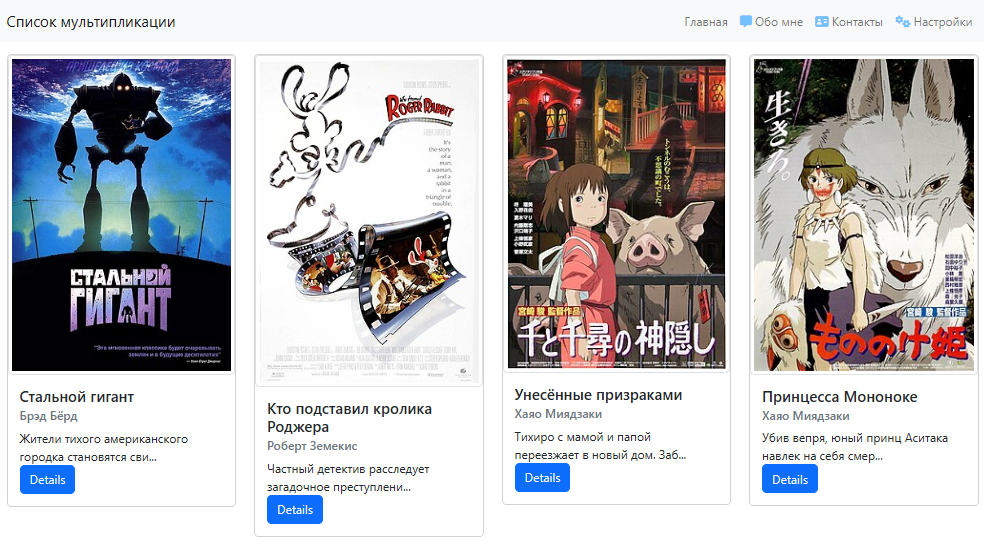
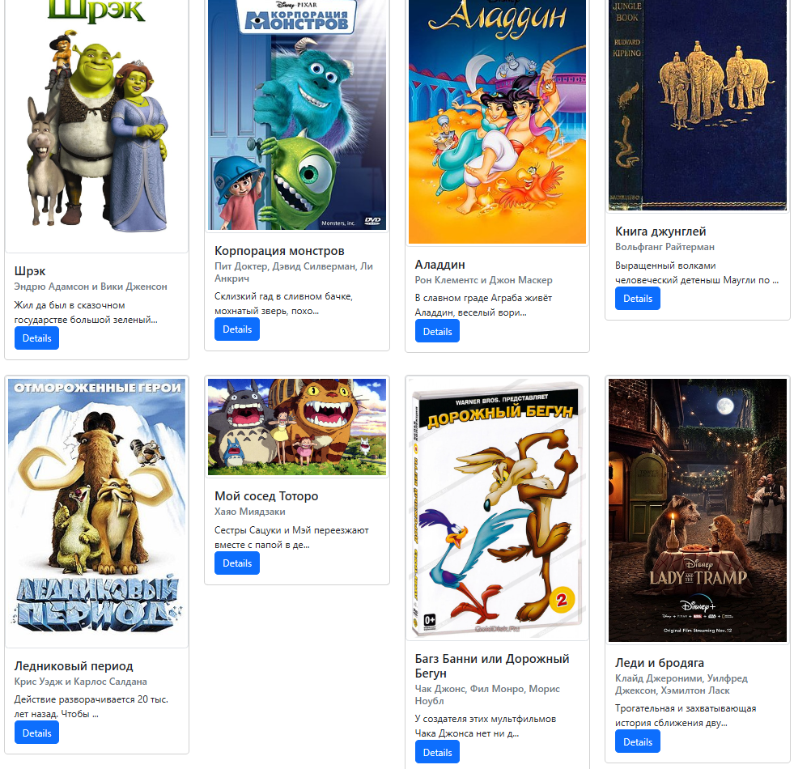
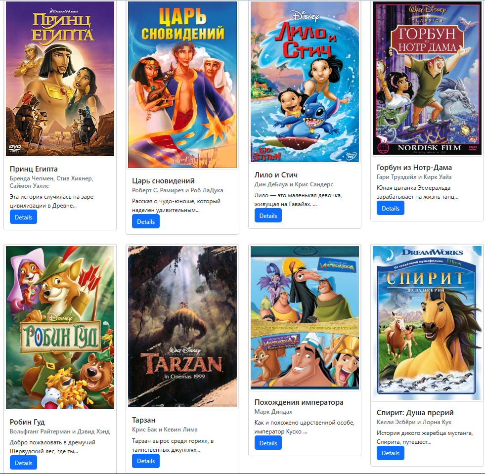
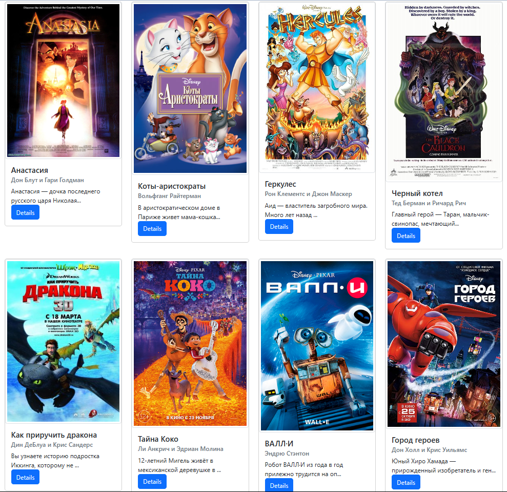
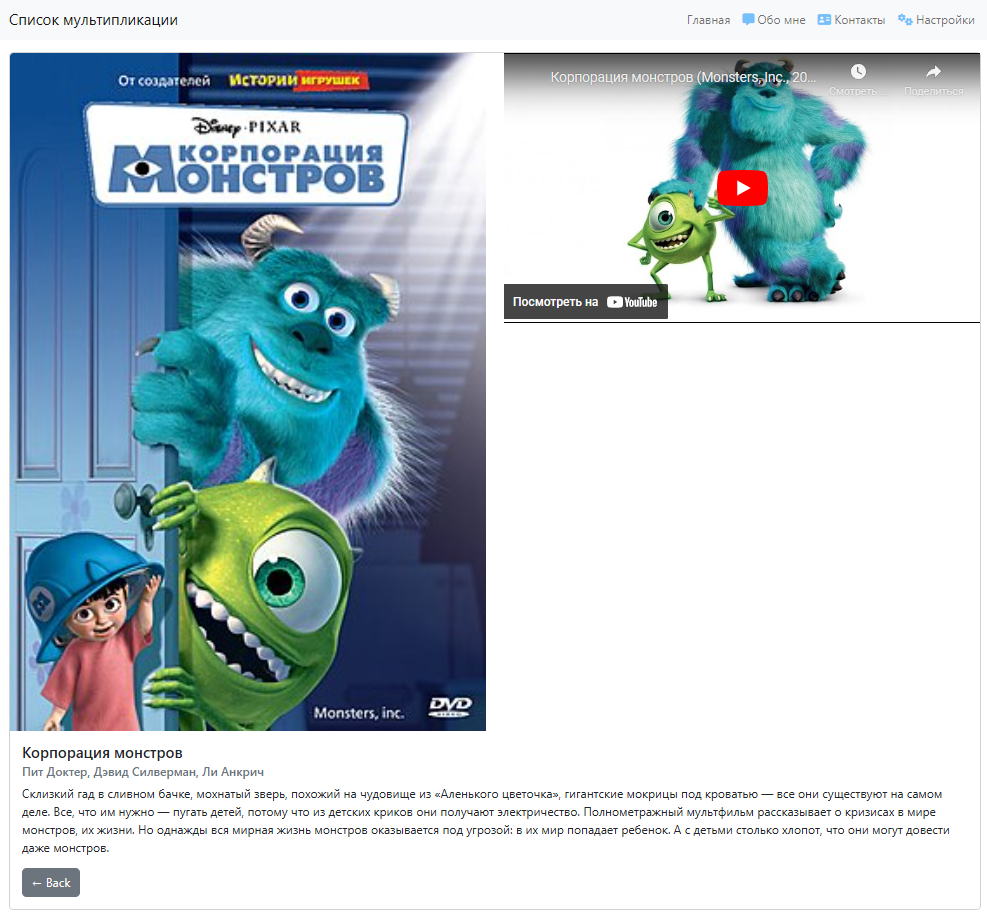
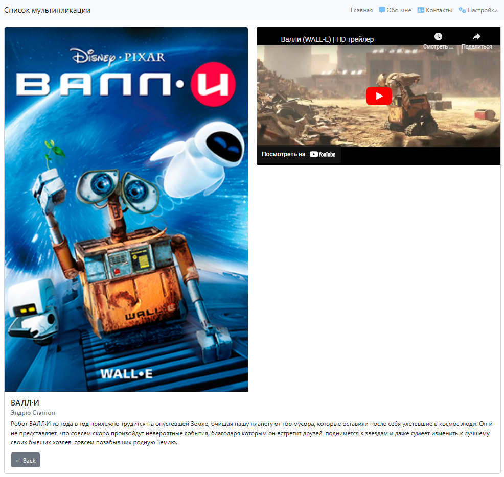
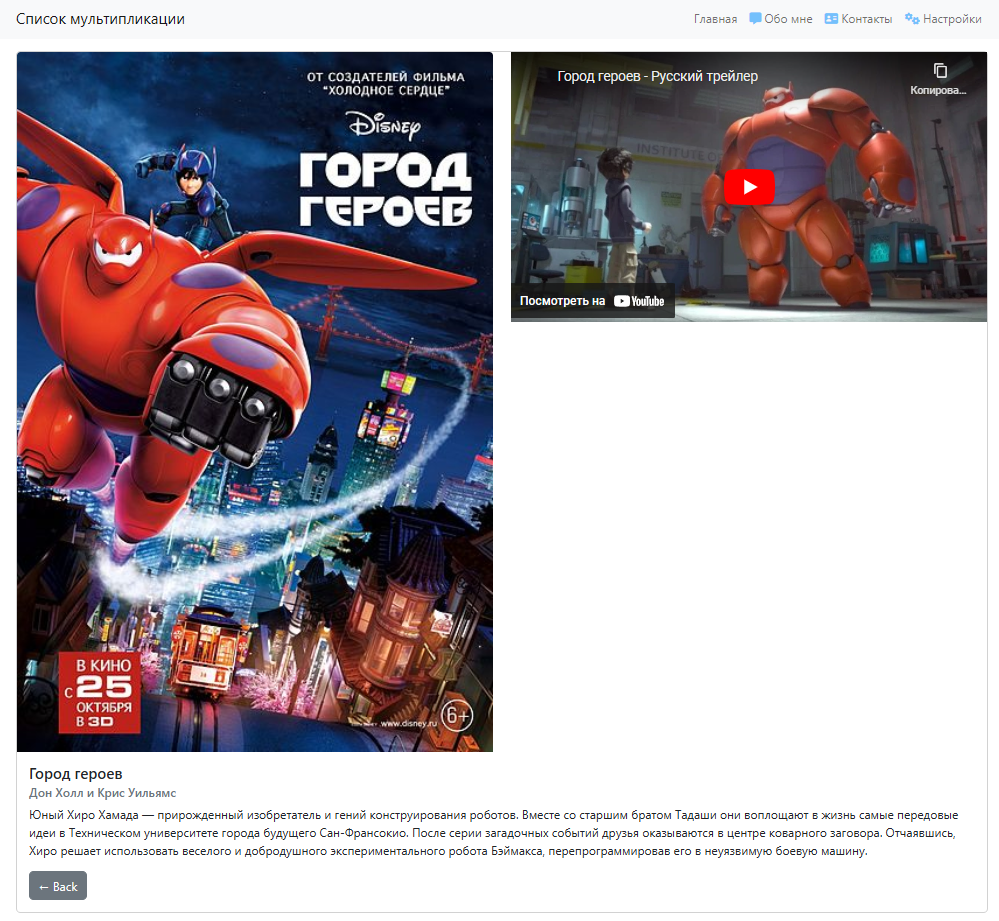
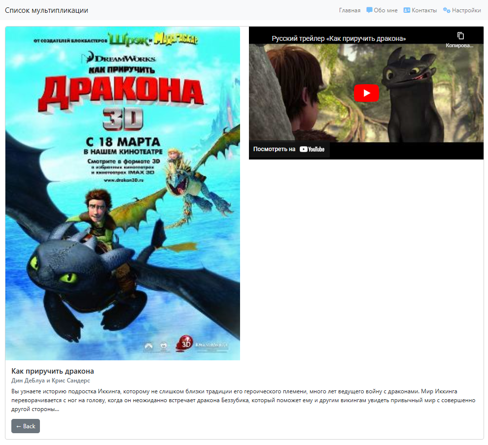
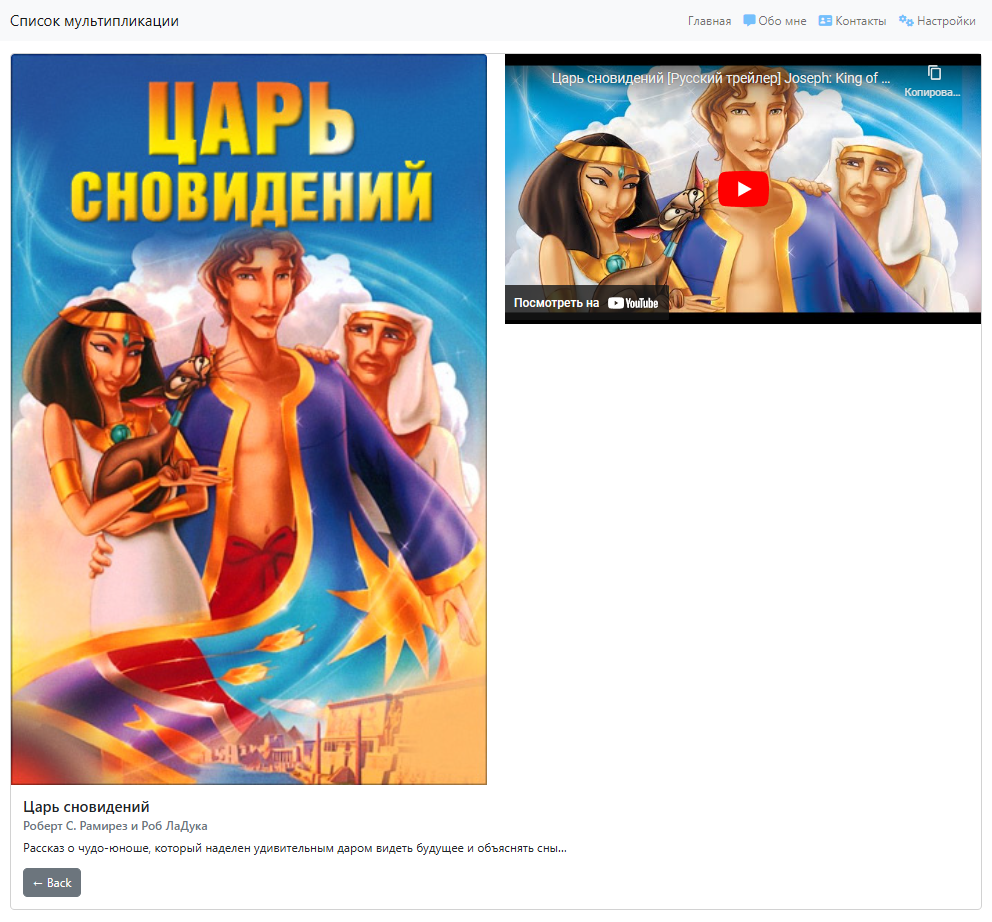
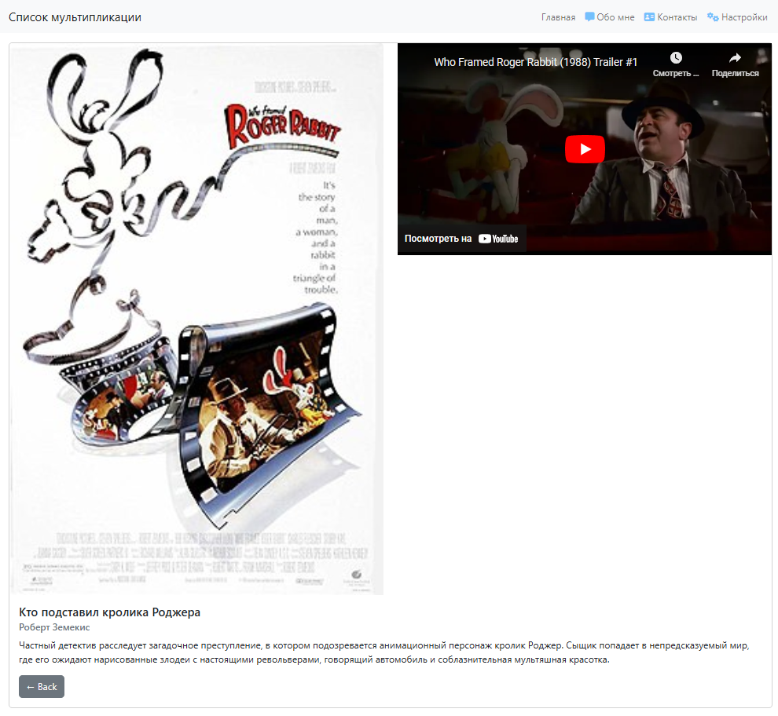

# flask_project
Интересный проект на web-фреймворке Flask.

💻 __Flask__ — фреймворк для создания веб-приложений на языке программирования Python, использующий набор инструментов Werkzeug, а также шаблонизатор Jinja2.

Относится к категории так называемых микрофреймворков — минималистичных каркасов веб-приложений, сознательно предоставляющих лишь самые базовые возможности.

💻 __Кинопоиск__ — это один из крупнейших российских онлайн-сервисов, предоставляющих информацию о фильмах, сериалах, актёрах, режиссёрах и других аспектах кинематографа.
Основан в 1999 году, Кинопоиск с тех пор стал неотъемлемой частью кинематографической культуры для многих пользователей в России и за её пределами.

Сервис предлагает обширную базу данных, включающую информацию о фильмах и сериалах со всего мира, начиная от классики и заканчивая последними релизами.

Пользователи могут найти рецензии, трейлеры, фотографии, а также узнать о съёмочной группе и актёрском составе. Кинопоиск также предоставляет возможность оценивать фильмы и сериалы, делиться своим мнением в комментариях и создавать персональные списки.

### Карточка мульпликации

#### 🖥️ Преподаватель: Дуплей Максим Игоревич
#### 📅 Дата: 29.07.2024